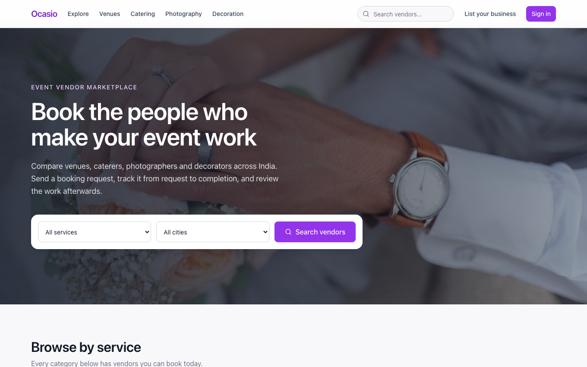
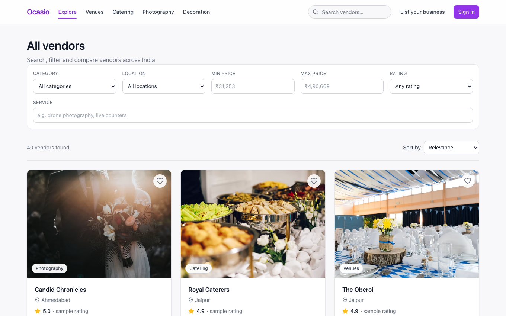
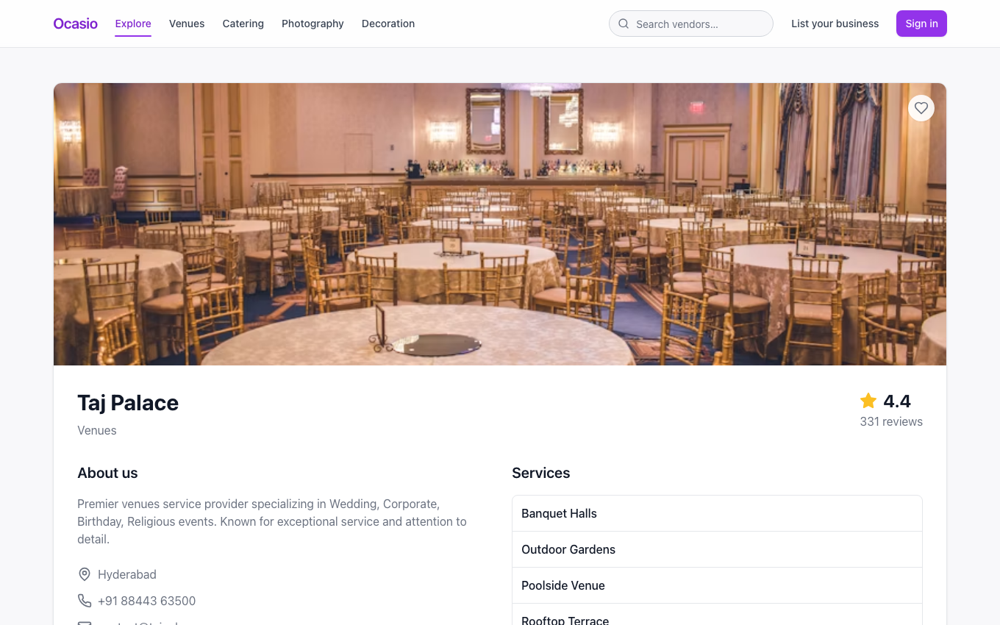
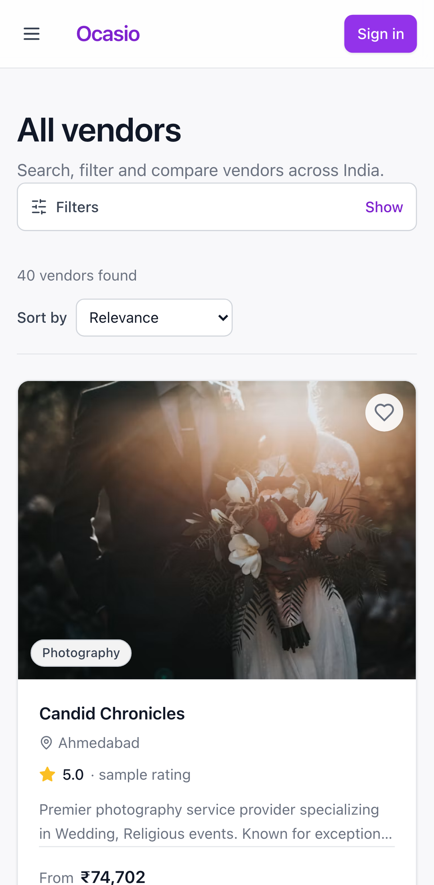
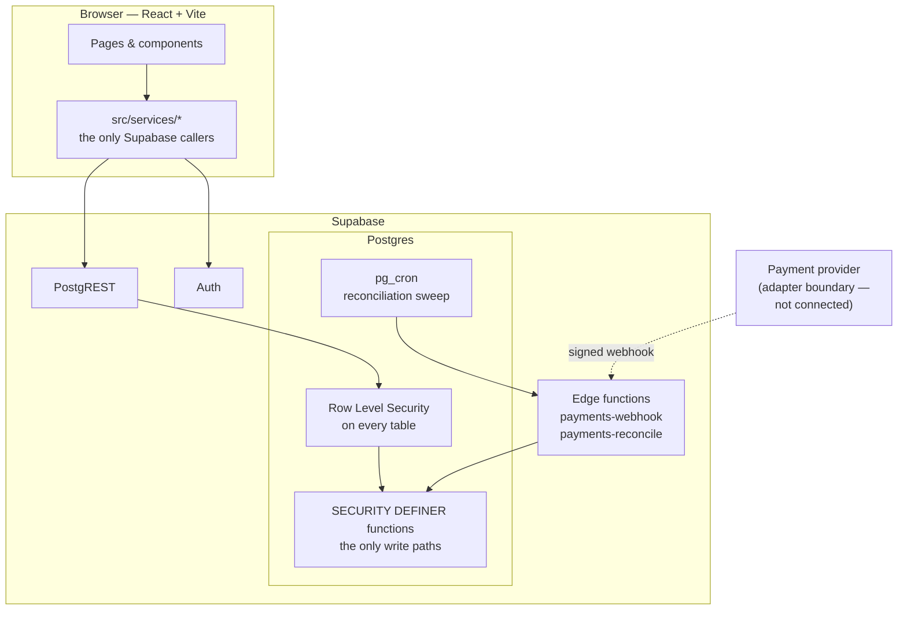
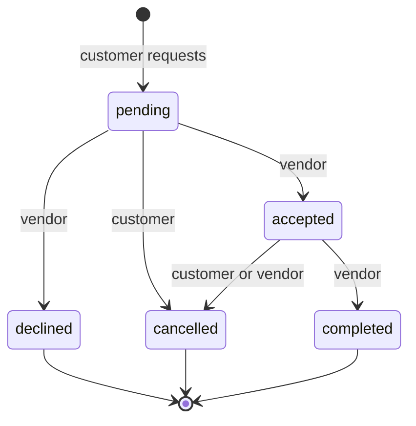
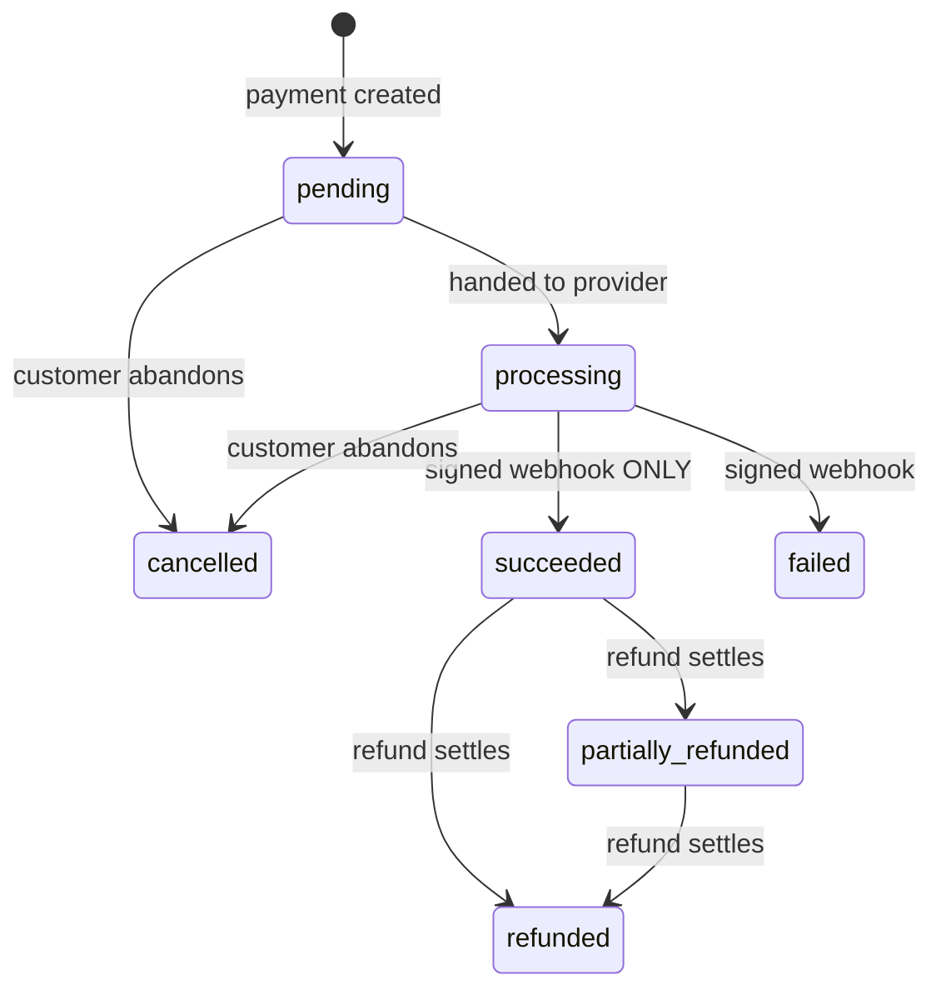

# Ocasio

**An event vendor marketplace — discover vendors, request bookings, pay, and review the work.**

Ocasio is a full-stack marketplace built on React and Supabase/Postgres. Customers find venues,
caterers, photographers and decorators, send booking requests, and review completed work. Vendors
manage those requests from their own dashboard.

The interesting part is not the UI. It is that **every rule that matters is enforced in the
database** — booking transitions, payment settlement, refund authority, review eligibility and
rating aggregates are all server-side, covered by Row Level Security, and proven by 238 integration
tests that run against real Postgres.

> ### Read this before evaluating the project
>
> - **No real payment provider is connected.** Money does not move. The payment domain, state
>   machine, webhook boundary and refund rules are real and tested; the provider adapter is a
>   deterministic local one.
> - **The vendor catalogue is sample data.** Those 40 listings are seeded demo records. Their
>   ratings are flagged `rating_is_demo` and labelled as sample data in the UI — they are replaced
>   by the real average the moment a genuine review lands.
> - **Reconciliation is scheduled but the edge functions are not exercised in CI.** They run on
>   Deno; the database functions they call are fully tested.
> - **Account deletion is restricted** for users with payment or review history, pending a
>   deliberate data-retention decision. See [`docs/OCASIO_DATA_RETENTION.md`](docs/OCASIO_DATA_RETENTION.md).

---

## Screenshots

| Home | Marketplace |
|---|---|
|  |  |

| Vendor profile | Mobile |
|---|---|
|  |  |

---

## What it does

**Customers** browse and filter vendors, save shortlists, request a booking against a specific
service and date, track it through its lifecycle, pay for an accepted booking, and review the work
once it is completed.

**Vendors** apply to list a business, and once approved manage incoming requests — accept, decline,
mark completed — and issue refunds against settled payments.

**The system** derives every authoritative value server-side: who owns a booking, what it costs,
whether a payment settled, who may refund it, and whether a review is allowed.

---

## Architecture



### The rule that shapes everything

> **The client supplies intent, never facts.**

A booking request names a service, a date and a location. It does not carry a customer id, a vendor
id, a price or a status — those are derived inside `create_booking()`. The same holds for payments
and reviews. Tables holding money or trust have **SELECT policies only**; every write goes through a
function that re-derives authorization from `auth.uid()`.

Opening DevTools and rewriting a request achieves nothing. There are tests for each case.

---

## Core flows

### Booking lifecycle



`declined`, `cancelled` and `completed` are terminal. Transitions run through
`transition_booking_status()`, which locks the row `FOR UPDATE` and returns *"Booking not found"* for
a booking that is not yours — the same message as one that does not exist, so the endpoint cannot be
used to probe for other people's rows.

### Payment lifecycle



**The browser can never reach `succeeded`.** `process_payment_event()` is granted to `service_role`
alone and is `SECURITY INVOKER`, so even an accidental grant to `authenticated` would still be
stopped by RLS.

### Review eligibility

A review requires a **completed booking that belongs to you**, one per booking, enforced by a
`UNIQUE` constraint. A customer cannot manufacture eligibility — only the vendor can mark a booking
completed. `vendors.rating` is recomputed from reviews by trigger and cannot be written by any
client.

---

## Tech stack

| Layer | Choice | Why |
|---|---|---|
| UI | React 18, TypeScript (strict), Vite | |
| Styling | Tailwind with a token layer | Semantic tokens, not raw palette values |
| Routing | React Router 6 | Route-level code splitting |
| Backend | Supabase (Postgres, Auth, PostgREST, Edge Functions) | |
| Search | Postgres full-text + `pg_trgm` | ~thousands of rows does not justify Elastic |
| Scheduling | `pg_cron` + `pg_net` | |
| Tests | Vitest against real Postgres | Mocking Supabase would not test RLS |
| E2E | Playwright, desktop + mobile | |

---

## Project structure

```
src/
├── components/ui/     design primitives (Button, Card, Badge, Field, Feedback)
├── components/        feature components
├── pages/             route components
├── services/          the only modules that call Supabase
├── contexts/          auth and favourites
├── hooks/             async, URL params, page meta
└── types/             database row types

supabase/
├── migrations/        7 migrations — the database is reproducible from these
├── functions/         payments-webhook, payments-reconcile
└── seed.sql           generated demo catalogue

tests/                 238 integration tests against real Postgres
e2e/                   32 Playwright specs, desktop + mobile
docs/                  architecture documentation
```

---

## Database and security

Seven migrations, applied in order, reproducing the whole schema:

| Migration | Contents |
|---|---|
| `…0001` | profiles, vendors, vendor_services, vendor_media, favorites |
| `…0002` | database-backed roles, RLS policies, vendor onboarding |
| `…0003` | full-text search, filters, `search_vendors()` |
| `…0004` | bookings, status history, lifecycle functions |
| `…0005` | payments, refunds, payment events, audit log |
| `…0006` | reviews, rating aggregates, payment reconciliation |
| `…0007` | scheduled reconciliation, rating provenance |

### Authorization model

`profiles.role` is the **only** authorization source. `auth.users.raw_user_meta_data` is writable by
the user via `supabase.auth.updateUser()`, so it is never trusted — there is a test asserting that
setting `user_type: 'vendor'` in metadata confers nothing.

Ownership, not role, authorises vendor management: a `vendors` row is managed by whoever `owner_id`
points at.

### RLS at a glance

| Table | anon | customer | vendor owner |
|---|---|---|---|
| `vendors`, `vendor_services`, `vendor_media` | read active | read active | + manage own |
| `reviews` | read (no author) | + create own via function | no write at all |
| `profiles`, `favorites` | — | own only | own only |
| `bookings`, `payments`, `refunds` | — | own, read-only | own vendor's, read-only |
| `payment_events`, `audit_log` | — | — | — |

No table holding money or trust has an INSERT, UPDATE or DELETE policy.

> **A trap worth knowing.** With no UPDATE policy, a malicious update silently matches zero rows and
> **returns success**. It does not error. Tests asserting "no error came back" would pass while
> proving nothing — so the suites assert that the row is *unchanged*.

### What is never stored

Card numbers, CVV, expiry, bank credentials, tokens, provider secrets. A trigger rejects an insert
whose payment metadata carries keys like `cvv` or `access_token`. The service-role key never reaches
the browser and does not appear in the built bundle.

---

## Testing

```bash
npx supabase start     # Docker required
npm test               # 238 integration tests
npx playwright test    # 32 E2E, desktop + mobile
```

Authorization tests run against **real Postgres with real RLS**. Mocking Supabase would prove
nothing about the thing actually enforcing access.

Security rules are **mutation-tested**: each phase deliberately weakened a rule and confirmed the
suite caught it. Two gaps were found this way and closed — a webhook replay guard that was masked by
a second check, and an ownership check whose mutation had silently failed to apply.

---

## Local setup

**Requirements:** Node 18+, Docker (for Supabase).

```bash
git clone https://github.com/tanmaytyagii/Ocasio.git
cd Ocasio
npm install

npx supabase start           # starts Postgres, Auth, PostgREST, Studio
cp .env.local.example .env   # point the app at the local stack
npm run dev
```

| Service | URL |
|---|---|
| App | http://localhost:5173 |
| Supabase API | http://127.0.0.1:54321 |
| Supabase Studio | http://127.0.0.1:54323 |

### Environment variables

Anything prefixed `VITE_` is inlined into the client bundle and is **public**.

| Variable | Notes |
|---|---|
| `VITE_SUPABASE_URL` | Project URL |
| `VITE_SUPABASE_ANON_KEY` | Public by design; only safe because RLS is on every table |
| `VITE_PAYMENT_PROVIDER` | Adapter name, defaults to `test` |

Server-only, set with `supabase secrets set` and **never** `VITE_`-prefixed:
`PAYMENT_WEBHOOK_SECRET`, `PAYMENT_PROVIDER`, `SUPABASE_SERVICE_ROLE_KEY`.

See [`.env.example`](.env.example).

### Commands

| Command | Does |
|---|---|
| `npm run dev` | Dev server |
| `npm run build` | Typecheck then production build |
| `npm run lint` | ESLint |
| `npm test` | Vitest |
| `npm run test:e2e` | Playwright |
| `npm run db:reset` | Rebuild database from migrations + seed |
| `npm run db:seed:generate` | Regenerate `supabase/seed.sql` |

---

## Deployment

Not currently deployed. To deploy:

1. `npx supabase link --project-ref <ref>` then `npx supabase db push`. **Do not run the seed
   against production** — it creates 40 fake businesses.
2. `npx supabase functions deploy payments-webhook payments-reconcile`, then set the secrets above.
3. Configure the reconciliation sweep per [`docs/OCASIO_OPERATIONS.md`](docs/OCASIO_OPERATIONS.md).
4. Build the frontend and host the static output anywhere.

---

## Current limitations

Stated plainly, because a marketplace that overstates itself is worse than one that does not:

- **No real payment provider.** Money does not move.
- **No messaging.** Not built; the UI does not pretend otherwise.
- **No availability or calendar.** Two customers can request the same vendor on the same date and
  the vendor can accept both. Faking a calendar without storing one would be worse than its absence.
- **No notifications.** Both parties check the site.
- **No payouts, commissions, disputes or chargebacks.**
- **No admin UI.** Vendor approval and refunds are `service_role` operations.
- **Seeded ratings are not review-derived** — flagged and labelled as sample data.
- **Edge functions are not exercised in CI.** Their signature verification is unit-tested and the
  database functions they call are fully covered.
- **Account deletion is blocked** for users with payment or review history.
- **Search is single-language** (`english` text search configuration).

---

## Roadmap

1. Connect a real payment provider through the existing adapter boundary
2. Vendor availability, then calendar-aware booking
3. Messaging between customer and vendor
4. Notifications (email first)
5. Admin surface for vendor approval and refunds
6. Resolve the account-deletion/retention decision
7. CI running the Deno edge functions

---

## Documentation

| Document | Covers |
|---|---|
| [`OCASIO_DATABASE.md`](docs/OCASIO_DATABASE.md) | Schema, roles, RLS philosophy, migrations, seed |
| [`OCASIO_MARKETPLACE.md`](docs/OCASIO_MARKETPLACE.md) | Search, filtering, pagination, URL state |
| [`OCASIO_BOOKINGS.md`](docs/OCASIO_BOOKINGS.md) | Booking lifecycle, permissions, pricing |
| [`OCASIO_PAYMENTS.md`](docs/OCASIO_PAYMENTS.md) | Payment state machine, webhooks, refunds, audit |
| [`OCASIO_REVIEWS.md`](docs/OCASIO_REVIEWS.md) | Reviews, rating aggregates, reconciliation |
| [`OCASIO_OPERATIONS.md`](docs/OCASIO_OPERATIONS.md) | Running the reconciliation sweep |
| [`OCASIO_DATA_RETENTION.md`](docs/OCASIO_DATA_RETENTION.md) | Account deletion analysis |
| [`OCASIO_PRODUCT_ROADMAP.md`](docs/OCASIO_PRODUCT_ROADMAP.md) | Phase history |

---

## Contributing

See [`CONTRIBUTING.md`](CONTRIBUTING.md). Security issues: [`SECURITY.md`](SECURITY.md).

## License

MIT — see [`LICENSE`](LICENSE).
